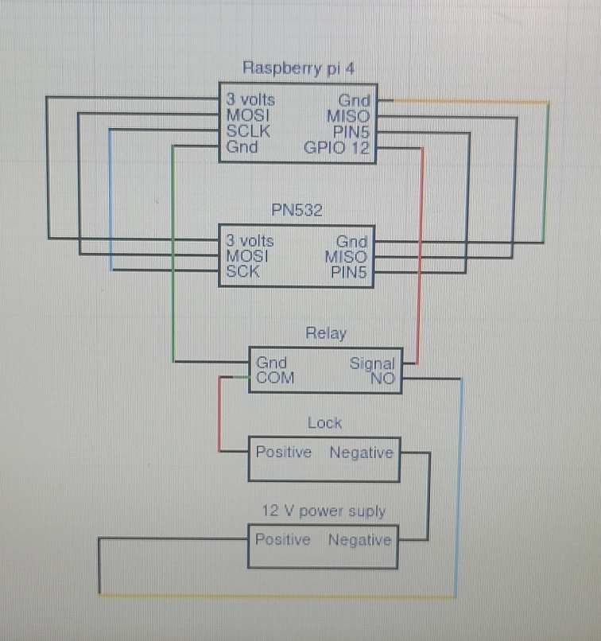
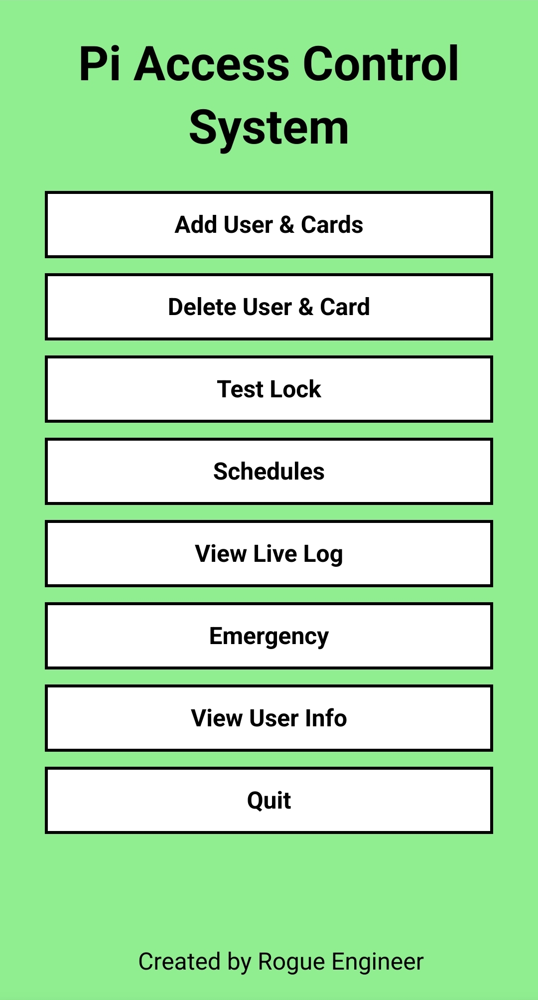

# Raspberry-Pi-Access-Control-System

Pi powered Access Control

* Tested on: Raspbian GNU/Linux 11 & 12
* Using: 32 bit
* RFID Reader: Adafruit pn532
* Powered relay: Adafruit Power Relay FeatherWing
* Lock: ANSI Standard Heavy Duty Electric Door Strike Lock
* Power Supply: DC 12V 2A Power Supply

## Wiring Diagram



## Main Menu




## Installation Instructions

The system uses GPIO 12 for relay control. The wiring diagram I went with is for SPI based on the [recommendations from Adafruit](https://learn.adafruit.com/adafruit-pn532-rfid-nfc/python-circuitpython).

All files are in the zip file, `accessc.zip`.

1. Make sure the OS has a user named "accessc" and unzip the files so it overrides the Documents folder.
2. Make sure you're in the accessc home directory:

     ```bash
     cd

     wget https://github.com/rogue07/Raspberry-Pi-Access-Control-System/raw/main/accessc.zip
     ```

3. Unzip file:

     ```bash
     unzip accessc.zip

     cd Documents
     ```

4. From the command prompt in the Documents directory run the installer:

     ```bash
     ./installer.sh
     ```

     It will update and upgrade the pi as well as install mariaDB, mysql-connector-python, adafruit tools and some other necessities. Lastly answer the questions as follows:

     * Switch to unix_socket authentication [Y/n] y
     * Change the root password? [Y/n] y
     * Remove anonymous users? [Y/n] y
     * Disallow root login remotely? [Y/n] y
     * Remove test database and access to it? [Y/n] y
     * Reload privilege tables now? [Y/n] y

5. Now that the installer has completed, let's setup the MariaDB database and table by running the following. ***Take note of the passwords you are setting, you'll need this in the next step.***

     ```bash
     python3 sqlSetup.py
     ```

6. Lastly let's run `setPasswd.sh` to change the default password in the scripts to the one that was set in the last step.

     ```bash
     ./setPasswd.sh
     ```

7. To start the program run:

     ```bash
     python3 accessc.py
     ```

or

Bring up a browser and navigate to:
     http://localhost/menu.php
